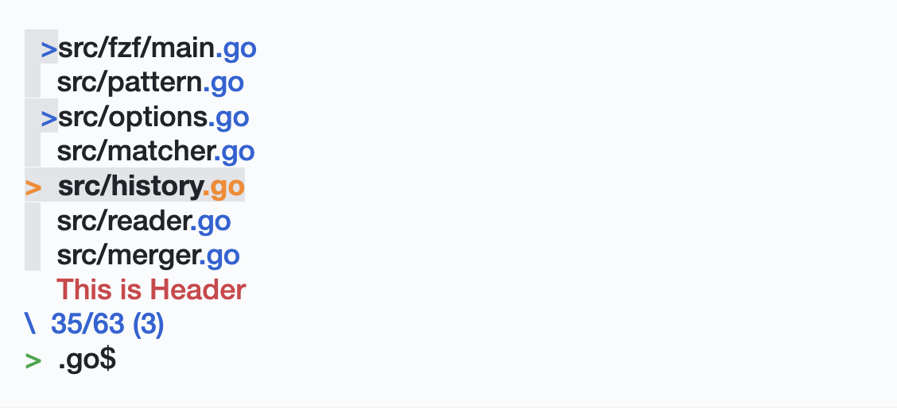

# [Rain](https://github.com/85clab0/rain-theme) for [fzf](https://github.com/junegunn/fzf)

## Screenshot

### Dark Theme (Night Rain)

### Light Theme (Day Rain)

## Install

[Install](INSTALL.md)

## License

[MIT License](LICENSE)
